# KnowledgePilot AI visual walkthrough

[Back to the project README](../README.md)

Follow a fictional engineering project from document upload to a verifiable source citation. Every image below is a screenshot of the running application, captured on September 26, 2026. Click an image to open its full resolution.

## Capture environment

- Next.js production server and the FastAPI browser test server (`tests.e2e_server`).
- A disposable PGlite/pgvector database with the Alembic migration applied, Fakeredis, and temporary original-file storage.
- Fictional account Alex Morgan (`alex.morgan@example.com`) and three fictional Orion engineering documents.
- The existing deterministic test provider handles embeddings and answers. It returns a retrieved excerpt with a citation; these captures do not demonstrate live model answer quality or provider billing.
- Desktop viewport: 1440 × 1000 CSS pixels, captured as 2160 × 1500 PNGs. Mobile viewport: 412 × 915 CSS pixels at the same 1.5× capture scale.

The walkthrough exercises real application pages and API requests. No production data or paid AI requests were used. Native PostgreSQL, Redis, and S3 deployment checks remain documented in the [validation record](validation.md).

## 1. Discover the product

The landing page introduces the workflow: bring documents into a workspace, ask questions, and follow the evidence.

[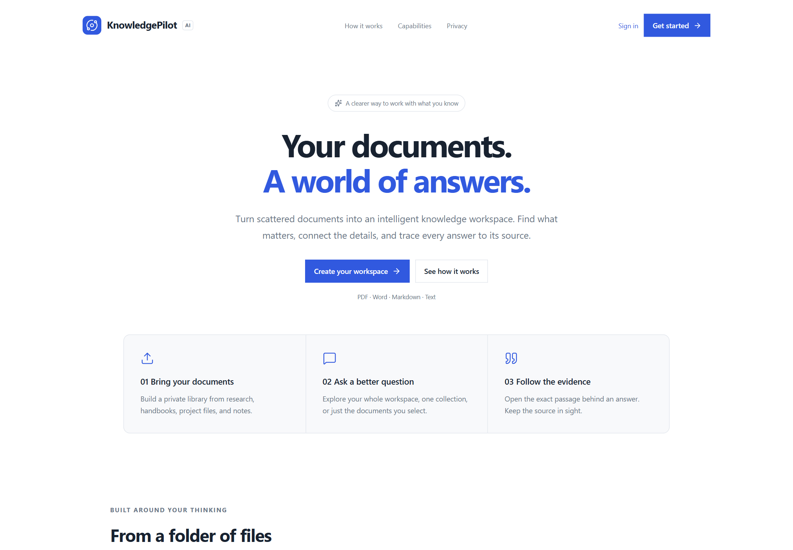](screenshots/01-landing.png)

## 2. Review the workspace

The overview shows three indexed documents, no pending processing, and one saved conversation. Recent files and conversations provide entry points into ongoing work.

[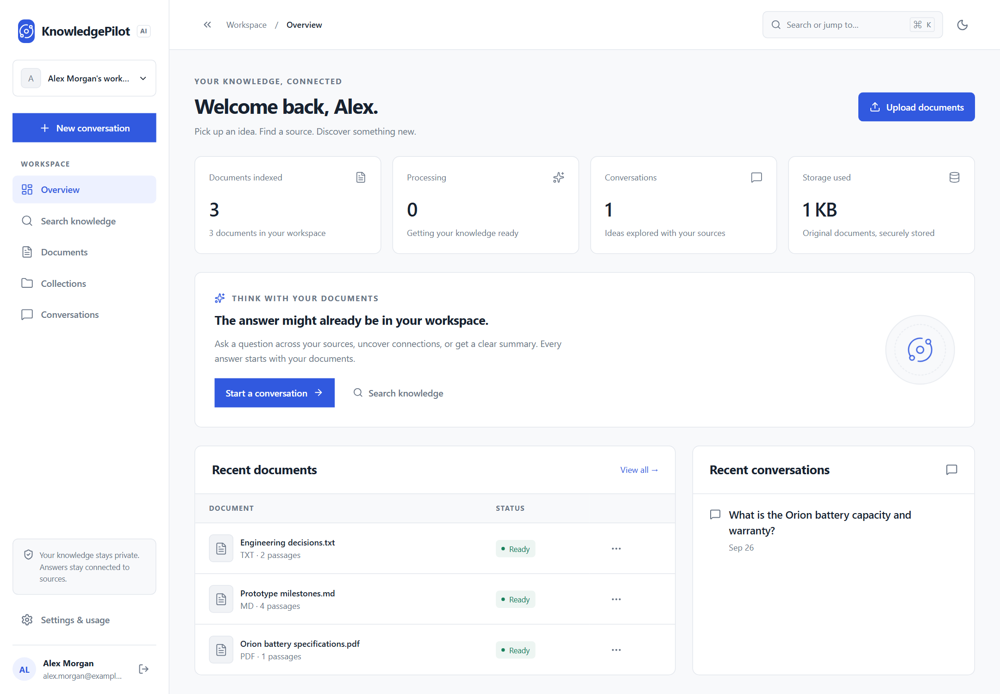](screenshots/02-dashboard.png)

## 3. Upload documents

Open **Upload documents**, then select files. This run uploaded a PDF specification, Markdown milestones, and text decisions into the Orion engineering collection. The completed upload rows confirm receipt; indexing continues in the background.

[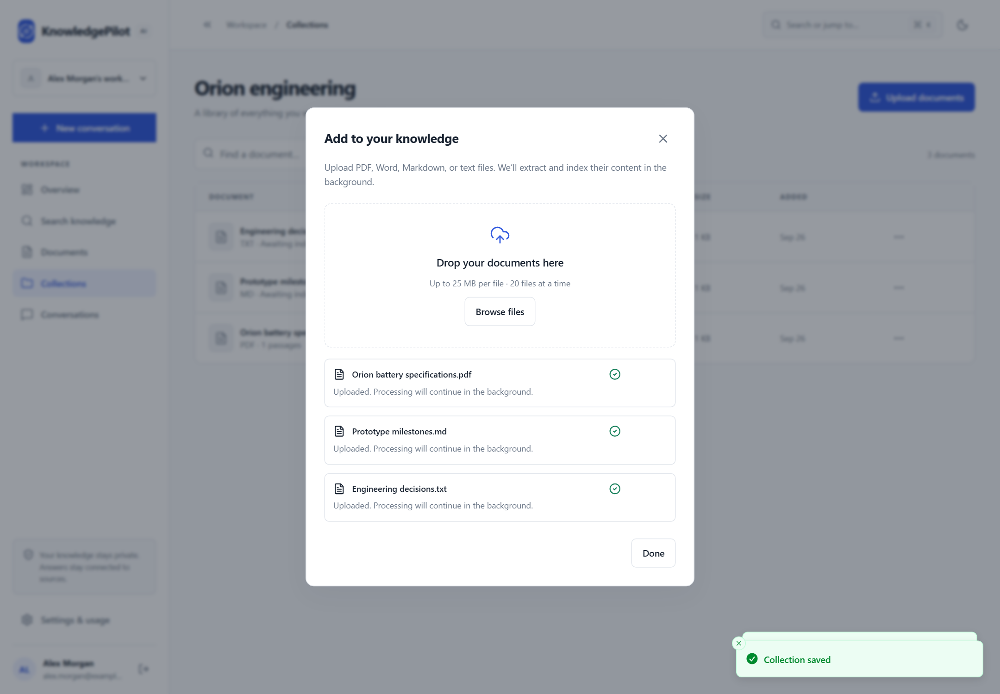](screenshots/03-upload.png)

## 4. Browse the document library

Wait for **Ready** before asking questions. Each row shows its file type, indexed passage count, size, date, and processing state. The library includes search, status filters, and sorting controls.

[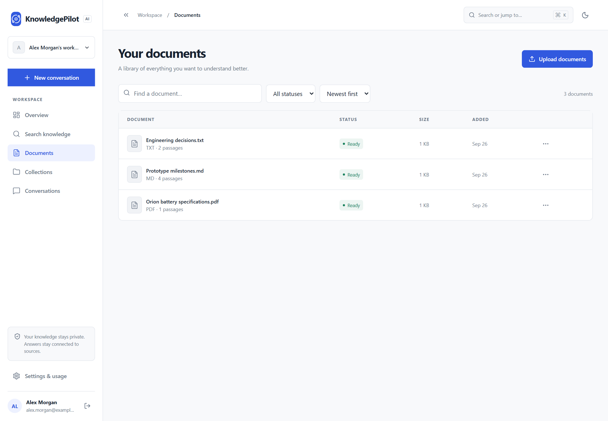](screenshots/04-documents.png)

## 5. Organize collections

Create collections for related material. The demo contains **Orion engineering** for project evidence and **Team operations** for future process documents. The three uploaded files belong to Orion engineering.

[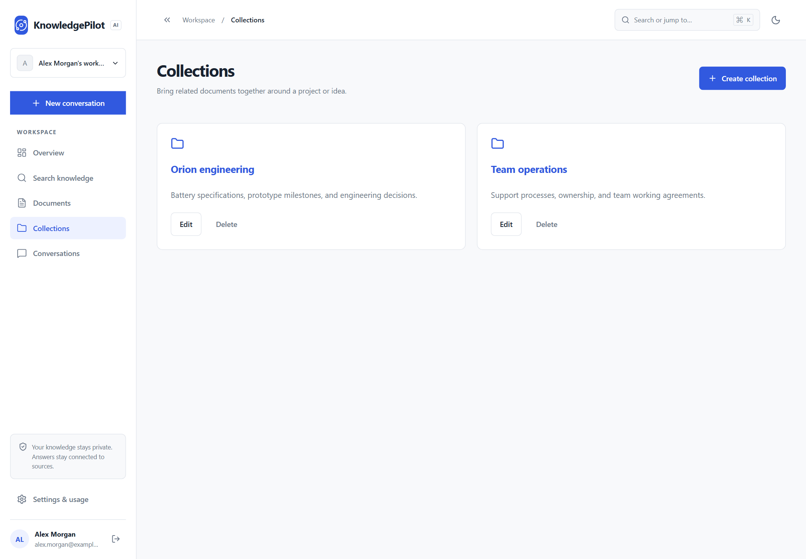](screenshots/05-collections.png)

## 6. Search the knowledge base

Search for **battery** using **Keyword search** to retrieve matching passages. This capture demonstrates keyword retrieval. Semantic and hybrid modes are available in the interface, with embedding quality dependent on the configured provider.

[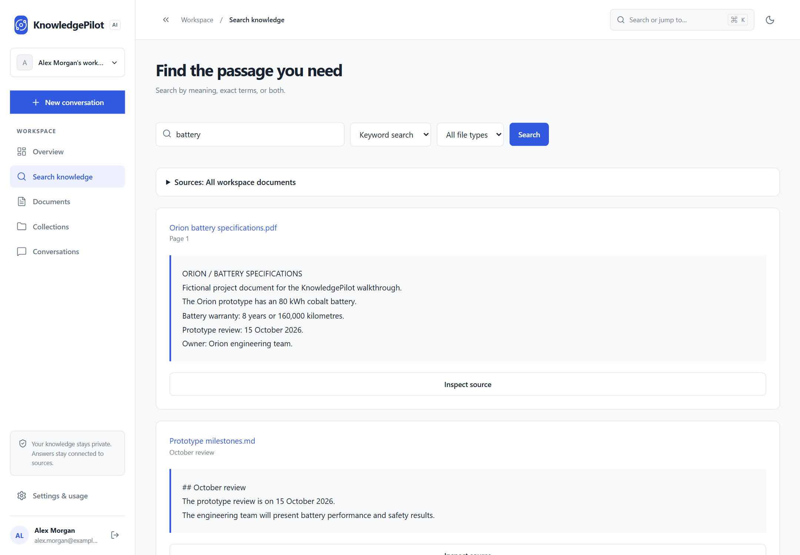](screenshots/06-search.png)

## 7. Ask with a selected source

Start a conversation, expand **Sources**, and select **Orion battery specifications.pdf**. Ask: “What is the Orion battery capacity and warranty?” The test provider returns the retrieved passage, including the 80 kWh capacity, warranty, and a page-one citation.

[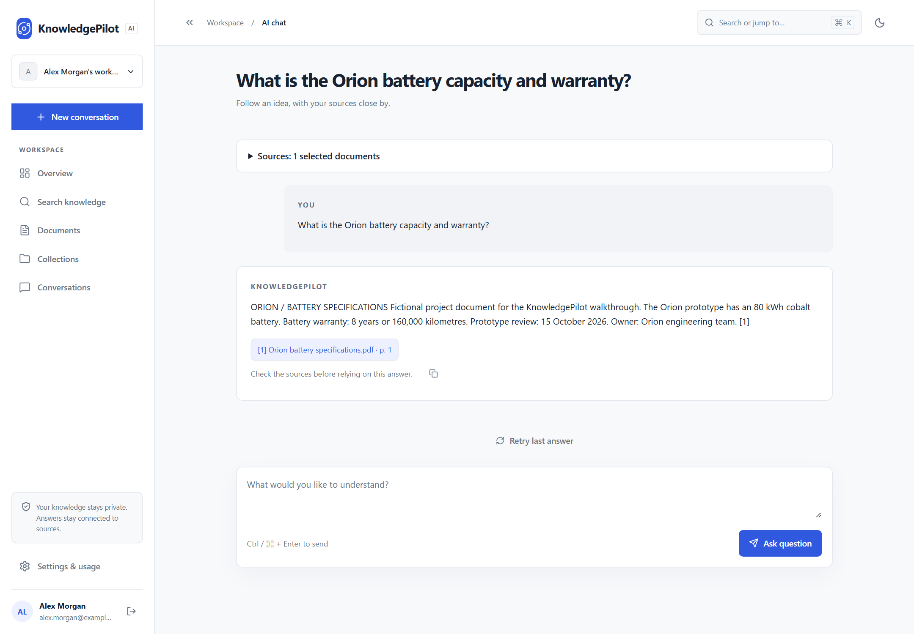](screenshots/07-chat.png)

## 8. Open the citation

Select the citation beneath the answer. The source dialog shows the passage and page number, with controls to inspect the document or download its original file. The original download was exercised successfully during capture.

[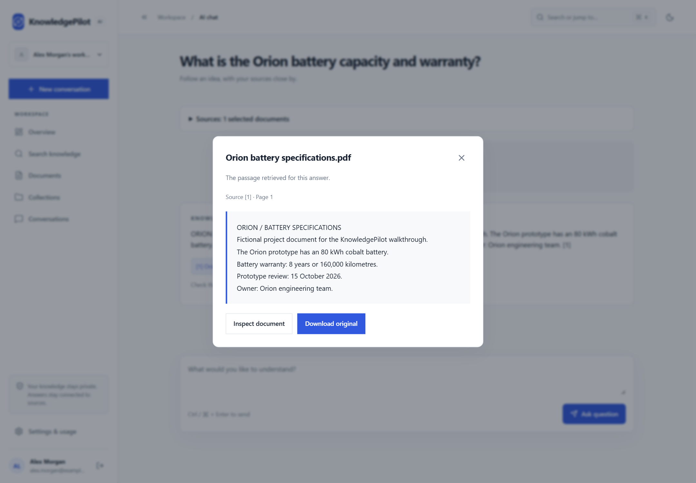](screenshots/08-citation.png)

## 9. Inspect the source document

Choose **Inspect document** to navigate to the cited chunk. The document view shows the extracted page, processing status, and original-file download control.

[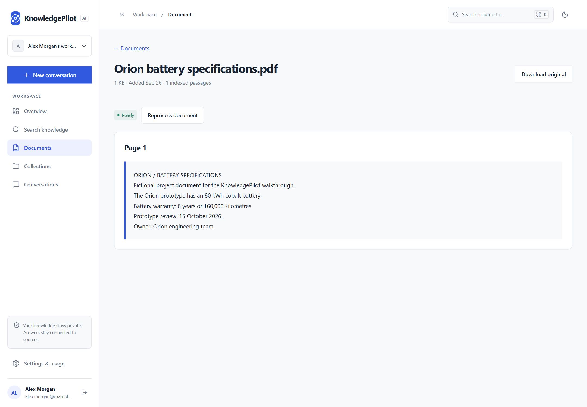](screenshots/09-source-document.png)

## 10. Revisit conversations

The question is saved in **Conversations**, where titles and messages can be searched. Opening the saved conversation restores its answer and citation.

[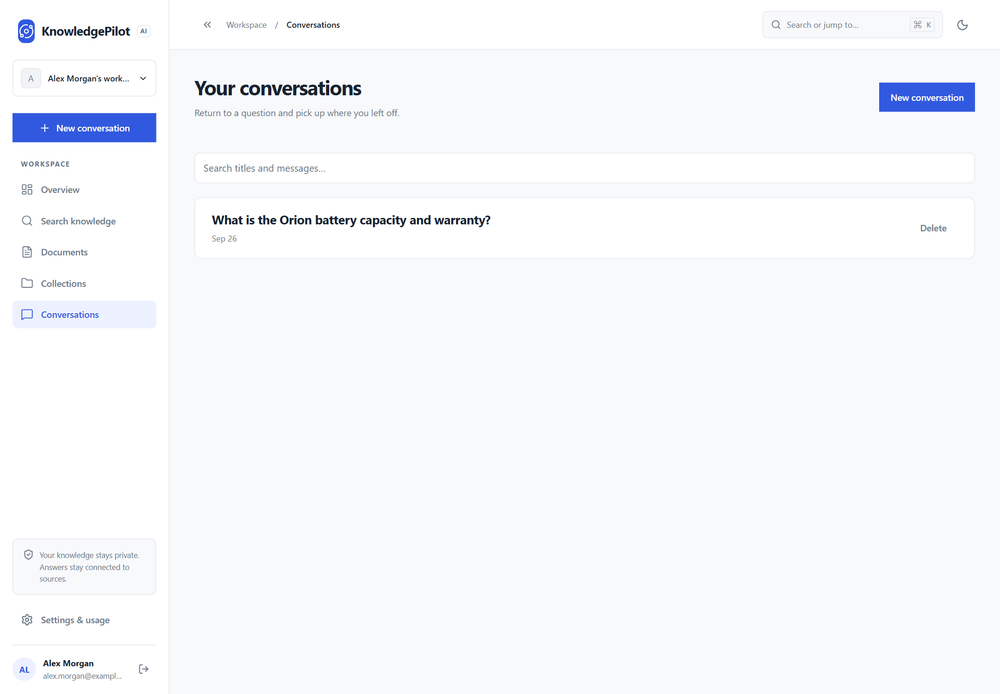](screenshots/10-conversations.png)

## 11. Manage preferences and usage

The settings page contains the display name, theme preference, document count, file storage, and recorded AI usage. Usage values here come from the test provider and do not represent billed provider consumption.

[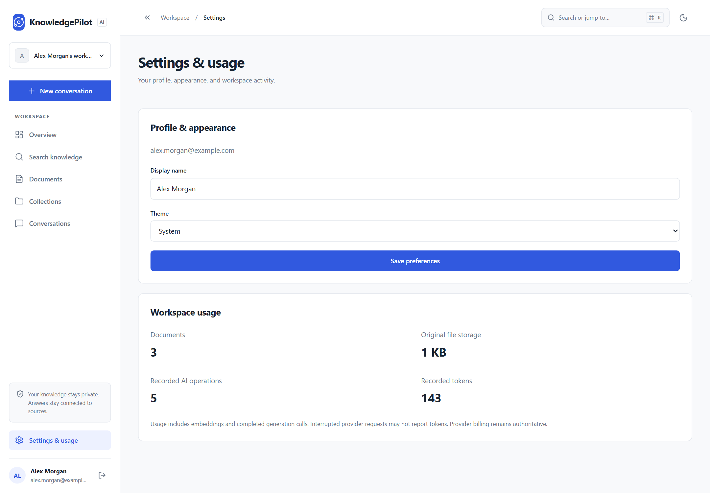](screenshots/11-settings.png)

## 12. Switch to dark mode

Select **Dark** and save preferences. The dashboard retains the selected theme when navigating between pages.

[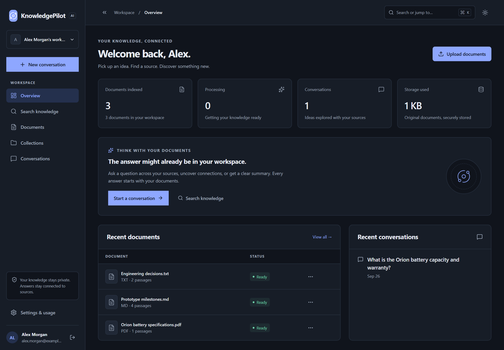](screenshots/12-dark-mode.png)

## 13. Continue on mobile

The saved conversation remains readable at a 412-pixel viewport, with the selected source, answer, citation, and question composer. This captured view passed the horizontal-overflow check.

<a href="screenshots/13-mobile-chat.png">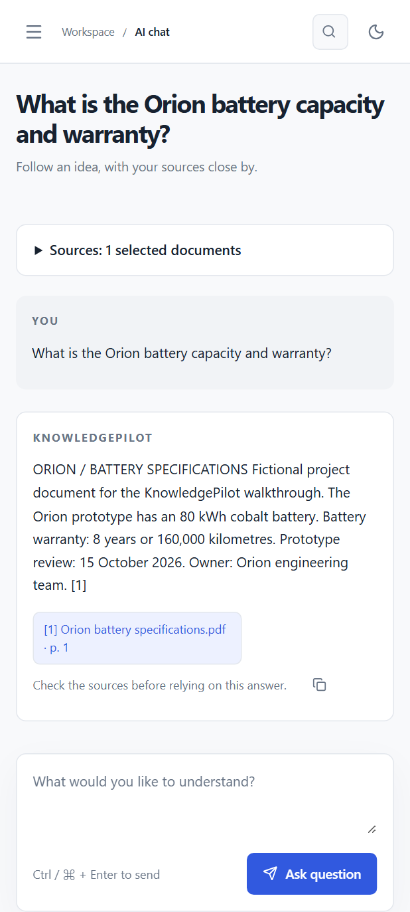</a>

## Verification from this capture

The automated browser journey completed registration, creation of two collections, three uploads, indexing to Ready, keyword search, a document-scoped question, citation inspection, original download, navigation to the exact source passage, conversation persistence, light/dark preferences, and mobile rendering. No uncaught browser errors were recorded.

This was a documentation capture and workflow smoke check. The full frontend/backend quality suites and native infrastructure acceptance tests were not rerun for this documentation-only change. See [validation.md](validation.md) for earlier checks and outstanding deployment validation.

An intermediate recapture on the reused demo services timed out with new uploads still queued. The final capture completed after restarting the disposable database and test backend. The cause of that intermediate stall was not established; this walkthrough does not establish long-running worker reliability.
